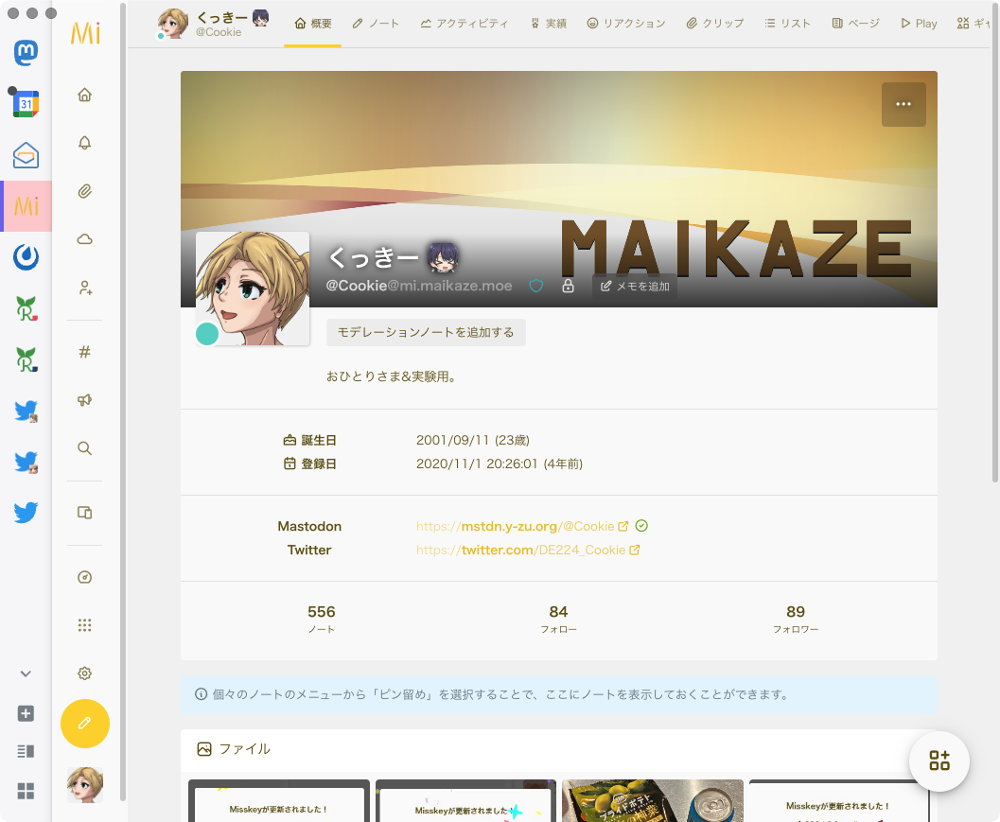

[Fediverse (2) Advent Calendar 2024](https://adventar.org/calendars/10064) 4日目の記事です。

### こんにちは

[くっきー](https://cookie.kumano.moe/) と申します。

Fediverse では、主に [Yづドン！](https://mstdn.y-zu.org/@Cookie) と [自分のMisskeyサーバ](https://mi.maikaze.moe/@Cookie) で活動しています。

お題も決めずに応募してしまったので、何を書こうか考えあぐねていましたが、今年ちょうど社会人になってしまったので、環境の変化とそれに伴うSNSとの距離感の変化についてポエムってみようと思います。

### そもそもSNSやってないよね

よくよく考えたら、自分が一番Fediverseで騒がしく過ごしていたのはGoogle+がなくなった2019年〜クローズドコミュニティに引き込もるようなった2021年頃までのごく短い期間でした。

とはいえ月に数回しか発言しない [Twitter](https://twitter.com/DE224_Cookie) に比べれば、日に数回〜数日に1回は発言しているFediverseは、現在のSNS活動における主軸といって問題ないでしょう。

しかし、Fediverseへの依存度が下がるにつれフォロー・フォロワーを増やすでもなく、比較的交流のあった方も引っ越したり活動の場を移したりで関わるユーザが減っていったなとは感じます。

一日中PCに張り付いて何かしらの作業をしながらひとりごちだり、TLにいる誰かに絡んだり……という使い方をしなくなって久しいです。

### そうして社会人になった

平日に全くSNSができない環境にいるわけではありませんが、 **正直平日の昼間に呟くことなんて「ねむい」と「かえりたい」ぐらいしかない。**

余暇も個人的な作業をするかクローズドコミュニティで喋るかの二択で、Fediverseのタイムラインを眺めるということをあまりしなくなりました。

クローズドコミュニティは似た属性の人がいるし、大っぴらに話せない話題も共有できるしで居心地が良いのですが、コミュニティの外側の意見や考え方がどうしても入ってきづらいです。

これはFediverseのサーバにおいても似たような特徴はあると思いますが、Fediverseには連合という概念があるので、当然風通しは良いですよね。

### 一方で5年目に突入した自分のMisskeyサーバ

2020年11月に遊びで建てたMisskeyサーバですが、なんと5年目に突入しました。

友人数名を招待こそしたものの、ほぼ「おひとりさま」として細々と運営しています。

ユーザも抱えていないですし、カスタムもUI程度しかイジっていないので、メンテナンスコスト自体はそこまで高くないのですが、数回の環境引越しを挟んでも特に事故なく続けられている点は胸を張っても良いかなと思います。

4年やってて500程度しか投稿していないあたりから低浮上であることが透けて見えますが、今後はメインであるMastodonのアカウント伝いにフォローを増やして行きたいという気はあります。

### 雑なまとめ

だらだらと書いてきたように、自分のSNSへの依存度はだいぶ下がってしまいましたが、今までやってきたSNSのなかでFediverseがもっとも居心地の良い場所であることは変わっていません。

社会人になってから、外からの刺激を受けるということが今まで以上に疎かになりがちなので、Fediverseでの活動も拡大していきたいという宣言をしておこうと思います。

ただ、フォローの増やし方もどんな投稿をすれば良いかも思い出せない……。テキトーでいいんだよね。

「やらなければいけない」というプレッシャーほど楽しくないものはないので、今後も自分のペースでゆるくやっていきます。
