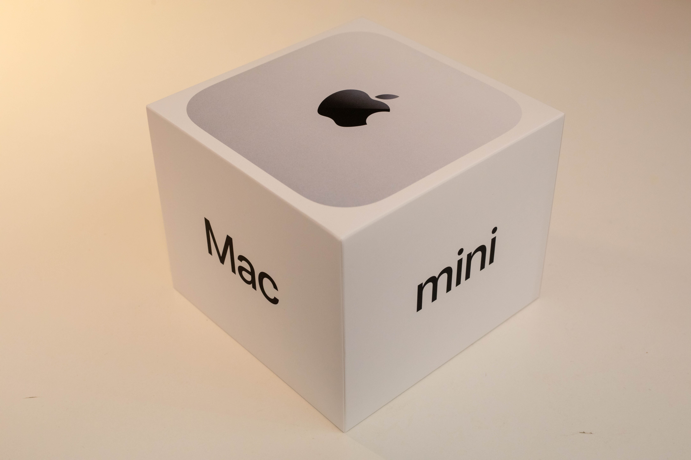
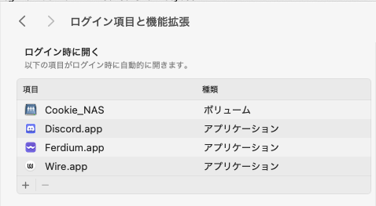
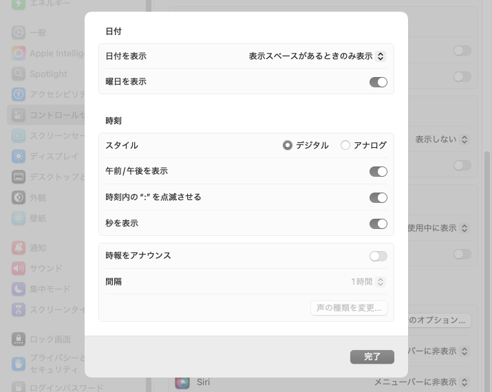
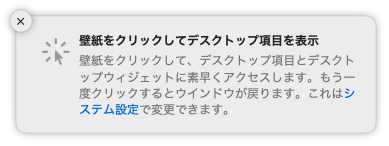
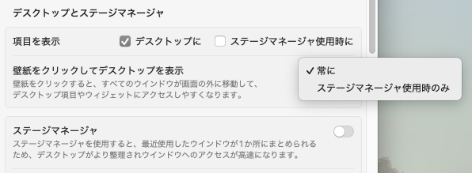
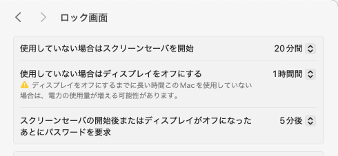
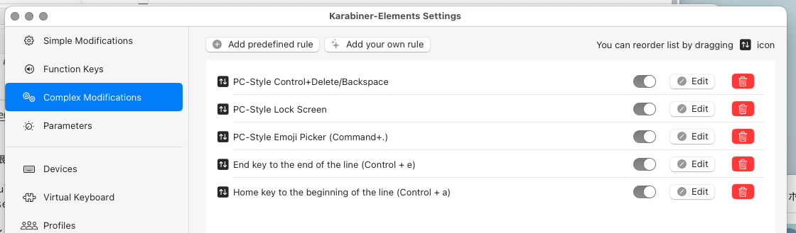

Appleアンチであるにも関わらず、 [新型Mac miniを買ってしまいました](https://twitter.com/DE224_Cookie/status/1851286209273995643) 。M4 Proですよ。ひー。

iPhone SE (第1世代) 以来なので、新品のApple製品を買うのは実に8年ぶりです。

ハードもソフトもすっかり勝手が変わってしまい、かつての直感的なUIは見る影もなくなっていますが、大枚叩いて買った以上は活用しないと勿体ない。さっさと設定していきます。

## やったこと

主に次のようなことをやりました。

- UIや基本動作の「システム設定」での調整
- ホスト名の設定
- OnyXのインストール
- Karabiner-Elementsによるキー動作のカスタマイズ
- Homebrewのインストール・シェルの設定
- 日本語入力（mozc）のビルド・インストール
- WSL2環境へのSSH

項目ごとにまとめていきます。

### UIまわり

システム環境設定がなくなってしんどい。どこのタブに何の項目があるかわからない。

#### まずフォントレンダリング

「使用可能な場合は滑らかな文字を使用」オプションが消えている。

RetinaディスプレイにあらずんばMacユーザにあらずということなのだろうが、Appleアンチの私には関係のないこと。

```shell
$ defaults -currentHost write -g AppleFontSmoothing -int 0
```

これでアンチエイリアスを切った。

#### 一般

重要な設定がここに入りこんでいる。Appleに限った話ではないけど、「一般」とか「その他」とか「便利な機能」とかに例外的な項目を押し込むのは良い設計ではないよね……。

##### ログイン項目と機能拡張



かつては「ユーザとグループ」にあったログイン時に自動で開くアプリの設定はここ。

#### コントロールセンター

メニューバーに表示されるアイコンなどはここで設定できる。ほとんどいらないので非表示設定に。



「時計のオプション」から、メニューバーの時計に秒数まで表示させるように。

#### デスクトップとDock

##### Dock

ここの設定項目は昔から変わらない。好きなように

##### デスクトップとステージマネージャ



これが曲者だった。デフォルトでは、デスクトップをクリックすると全てのウィンドウが捌けてしまう。



大変不愉快なので、 **「壁紙をクリックしてデスクトップを表示」を「ステージマネージャ使用時のみ」に変更** する。

その他の設定もよしなに変更する。

##### 外観

ここも昔から変わらない。自分は強調表示色を「グラファイト」に変更する。

##### ロック画面



昔は「省エネルギー」にあったディスプレイのタイムアウト等に関する設定はここにある。

ダメダメ翻訳かわいい。

### ホスト名の設定

厳密にはmacOSのお名前は3種類あるが、GUIからちまちまいじるよりは `scutil` コマンドで設定してしまうのが楽そう。

```shell
$ scutil --set ComputerName Taiho
$ scutil --set LocalHostName Taiho
$ scutil --set HostName Taiho
```

### OnyXを入れる

[これがないと始まらない](https://titanium-software.fr/en/onyx.html) 。

### Karabiner-Elementsを入れる

HomeやEndキーの挙動がWindowsと違うのが気に入らない。なんとかします。

まず [Karabiner-Elements](https://karabiner-elements.pqrs.org) をダウンロード・インストール。

起動したらキーボードレイアウトを教えてあげて、諸々の権限をつける。

Complex Modificationsタブから「Add predefined rule」を選択し、「Import more rules form the Internet (Open a web browse)」をクリック。

ブラウザが開くので、「PC-Style Shortcuts」を探してインポート。



インポートされたショートカットの中から、「Home key to the beinning of the line (Control + a)」、「End key to the end of the line (Control + e)」を有効にする。

### Homebrewを入れる

[brew.sh](https://brew.sh) の言うとおりにインストール。

#### ついでにfishを入れる

人間に優しいシェルを入れよう。

```shell
$ brew install fish
```

`/etc/shells` に `/opt/homebrew/bin/fish` を追記した上で、デフォルトのシェルを変更

```shell
$ chsh -s /opt/homebrew/bin/fish
```

homebrewのパスを通す。

```shell
> fish_add_path eval /opt/homebrew/bin
```

### mozcを入れる

Google日本語入力を入れようとしたら、amd64だった。さすがに常駐するアプリがそれは……というわけで。

[りぃどみぃ](https://github.com/google/mozc/blob/master/docs/build_mozc_in_osx.md#software-requirements) の言うとおり、XCodeやBazel、CMakeを入れた上でビルドしてインストール。

自分はfishを使っているので、venvをアクティベートするところでは `venv/bin/activate.fish` した

### WindowsのWSL2環境にSSHできるように

WSL2の開発環境を使いたいので、VSCodeからSSHできるように設定する。

#### ファイアウォールとポートプロキシの設定 （Windows）

PowerShellを管理者権限で開く。

```shell
> netsh advfirewall firewall add rule name="WSL2" dir=in action=allow protocol=TCP localport=22
```

22番が開いた。

```shell
> netsh interface portproxy add v4tov4 listenport=10022 connectaddress=[WSL2のIP] connectport=22
```

これで22番へのアクセスがWSL2へ転送される。

### SSHの設定 (WSL2)

`/etc/wsl.conf`が以下のようになっているか確認

```conf
[boot]
systemd = true
```

sshをインストールして起動して有効化

```shell
$ sudo apt install openssh-server
$ sudo systemctl start sshd
$ sudo systemctl enable sshd
```

公開鍵の登録をしたければする。

必要に応じてmacOS側でsshのconfを書いてやるなどして、終了。
