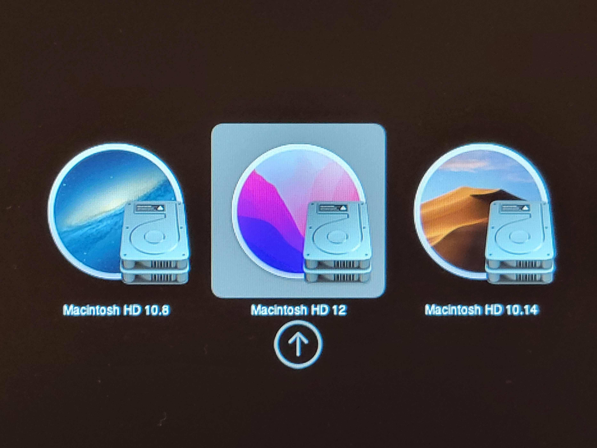

[年末の記事](/yt-advent2021-macpro/) の構成からさらに[CPUを換装](https://twitter.com/DE224_Cookie/status/1480437910138941440)し、名実ともに“最強”になった私のMac Pro (Mid 2010)ですが、このマシンが対応している最新のOSであるmacOS Mojaveでは、多くのソフトウェアでアップデートを受けられなくなってきました。

Logic ProやAdobe CCの最新バージョンが使えないのは流石に困るので、新しいMacを買うことを検討し始めたのですが、昨今の最悪な為替レートと半導体不足のダブルパンチ、さらに現行Macのビミョーなラインナップなど、明らかに買いどきではないため、泣く泣く(?)Mac Pro (Mid 2010)の延命を決意、本来はサポート対象でない最新のmacOS Montereyを無理やりインストールすることにしました。

### やったこと
上述のとおり、macOS MontereyはMac Pro (Mid 2010)をサポートしていません。

そこで、[OpenCore-Legacy-Patcher](https://github.com/dortania/OpenCore-Legacy-Patcher)というソフトウェアを使用します。

また、以前から使っていた**OS X v10.8とmacOS v10.14の環境も残しつつ**作業を進めていきます。

##### 工程はざっくり以下のとおりです。

1. USBメモリを用意する
1. [OpenCore-Legacy-Patcherのリリースページ](https://github.com/dortania/OpenCore-Legacy-Patcher/releases/)からGUIアプリを落としてくる
1. 同アプリを開き、画面の指示に従ってmacOSのインストールメディアを作成、OpenCoreのブートローダもUSBにインストール
1. USBからブートし、（今回はOSを共存させるため起動ディスクのパーティションをあれこれするなどしてから）macOS Montereyをインストール
1. 起動ディスクにOpenCoreをインストール
1. macOS Montereyのムカつく表示や設定を少しマシにする

[公式にすげー整ったドキュメントがある](https://dortania.github.io/OpenCore-Legacy-Patcher/)ので、やってみたい人はこちらを参照されたし。

本来、Monterey（というかMojave以降）に対応していないMacの多くは、**搭載されているGPUがMetal APIに対応していない**ため、macOSのインストール後にOpenCore-Legacy-Patcherに含まれているGPU Acceleration Patchを当ててやる必要がありますが、このMacには[年末の記事](/yt-advent2021-macpro/)でご紹介したとおり、Metal対応のATI Radeon HD 7950が入っているので、その必要はありませんでした。

さて、次節からは作業内容をゆるく紹介していきます。

### OpenCore-Legacy-Patcherでインストールメディアを作成

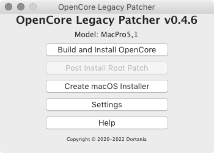

まずOpenCore Legacy PatcherのGUI版を落としてきます。

アプリを起動したら、“Create macOS Installer”を選択、画面の指示に従ってポチポチと進めていきます

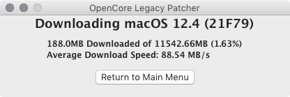
ダウンロード中。

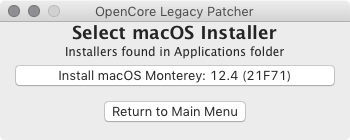
ダウンロードが終わったら、インストールメディアを作成する。

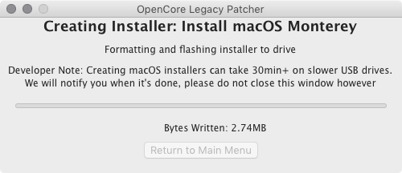
結構な容量をちまちまUSBに書き込むので、それなりに時間がかかります。待つべし。

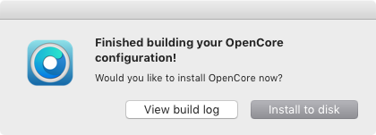
あとは、ブートローダをビルドしてインストールするだけ。これも勝手にやってくれるので楽ちん。

### インストールなど

まずmacOS Mojaveの環境を別の起動ディスクに移します。これが一番時間取られる。

ここからが本番。スタートアップマネージャから、先程作成したインストールメディアを選択すると、

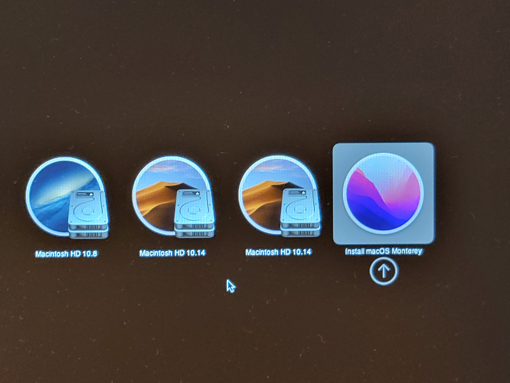
OpenCoreの画面になるので、Montereyのインストーラを選択。

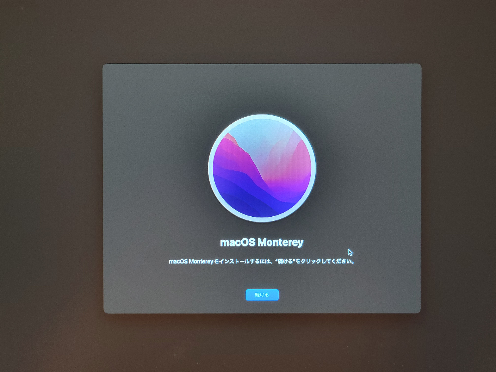
> 新しい場所 探すときがきたよ
この先はいつもどおり、画面に従って初期設定をするだけですな。

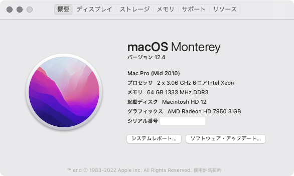
**ドンッ！**

実は初回起動時、GPUアクセラレーションが正常に動作していなかったのですが（全体的に描画がモッサリし、透過やぼかしの処理ができていないなどの症状）、これは再起動で解決しました。

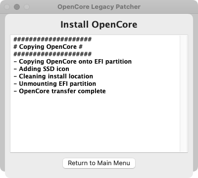
最後に、ブートローダをSSDにインストールします。

起動時はSSDにインストールしたOpenCoreブートローダ経由で起動ディスクを選ぶ必要があります。スタートアップマネージャから直接Montereyの起動ディスクを選んでも、駐禁マークが表示されるだけでブートできません。

### ムカつくUIをマシにする

いざインストールに成功してみると、やたらデカくて丸っこいUIデザインが鼻につきます。せっかく大きな画面サイズなのに、UIの各要素がタッチ操作できそうなほど大きいのは考えものです。

また、UIサイズ以外にも画面の隅々から何とも形容詞しがたい「気持ち悪さ」を感じていました。

UIサイズについては、Finderのサイドバーが何よりも気に入らなかったのでそこを変更しました。

そして、「気持ち悪さ」の大部分は半透明でブラーがかかったUIによることが判明したため、アクセシビリティ設定からそれも無効にしました。

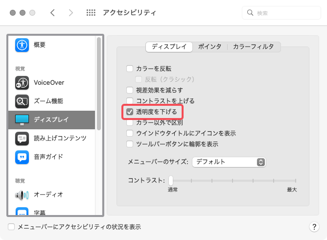

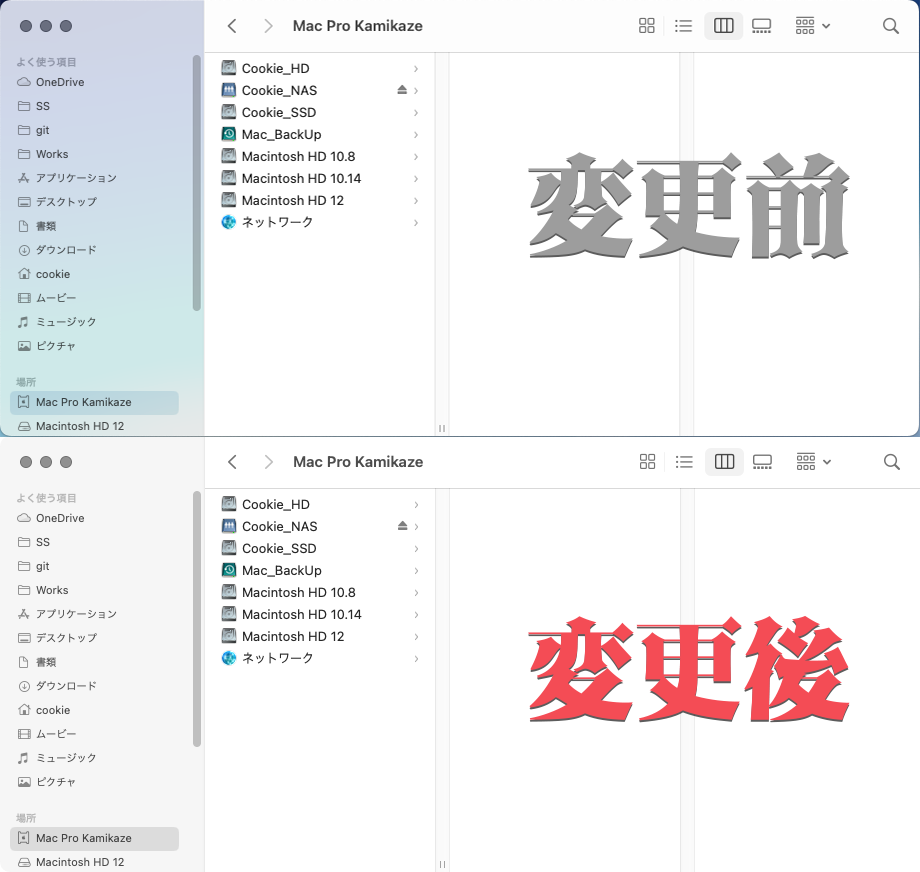

少しはマシになったかな。嫌いだけど。

### アップデートは普通に降りてくる
Montereyを入れたものの、ずっとMountain Lion環境での作業が続いていましたが、久しぶりにMontereyを起動したらmacOS 12.5のアップデートの案内が来ていました。
特別な操作をすることもなく、すんなりとアップデートすることができました。

### その他感想
UIこそ気に入りませんが、これといった不具合もなく安定して動いています。12年前のマシンだとは思えないほどサクサク動くし、視覚体験以外は非常に快適です。

また記事を改めて書きますが、メインで使っているWindowsマシンが故障したせいで、図らずもMonterey環境をガンガン使うことになってしまいました。

本来の用途であるDTM以外にも大学レポート関連作業（地味にメモリを食いつぶす）に落書き、動画編集などなど、メインマシンが担っていた作業を当分の間Mac Pro (Mid 2010)で行うことになります。

これからも使い倒していくぜ！