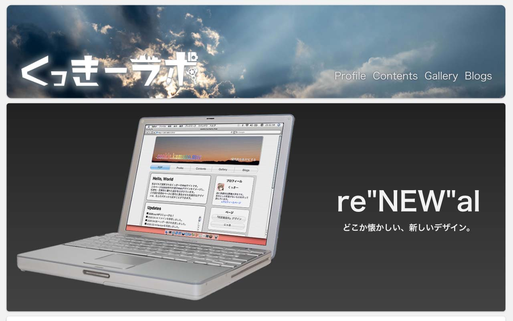
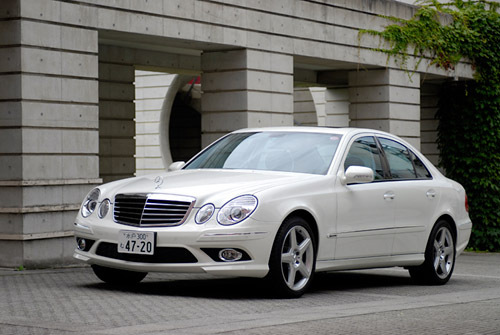

[Yづドン/テクノロジー合同 Advent Calendar 2021](https://adventar.org/calendars/6890) 17日目の記事です。

慣れないながらマークダウンで書いてみるよ。

### はじめに

> 人間が“これは絶対に正しい”と思っているとき、ほとんどの場合その事実は 既に過去のものになっている

今回は、私が今までのアドベントカレンダーで触れてきたような、Aquaインターフェイスへの異常な執着に代表される、特定の時代のプロダクトへ回帰しようとする私の行動（＝ルネサンス）について、この衝動がどこに根ざすものなのかを探っていきたいと思います。

私のルネサンスは、UIデザインの選好にとどまらず、その対象は多岐にわたります。

- コンピュータハードウェア・ソフトウェア
- 自動車
- コンシューマゲーム
- アドベンチャーゲーム
- テレビアニメ
- などなど……

そして、これらの多くは2000年代のものです。

### 「ルネサンス」の具体的な内容と精神的な依存

ここでは、まず私の「ルネサンス」がどういったものなのかを軽く書いていこうと思います。

#### 具体的な内容
##### コンピュータ
コンピュータに関わる部分については、以前の記事でそれなりに触れたため多くは言及しません。

私は1998年〜2011年のアップル製品が大好きです。特に、アルミニウムのPowerBook G4、箱型のMac Pro、iPhone 4Sなどは格別です。

他社のハードウェアについては、特定の世代に強い思い入れがあったりはしませんが、ソフトウェアに関してはWindows xpやVista、7のデザインは好きでした。しかし、これも「ルネサンス」しようと思えるほどの愛着はありません。

##### 自動車

[出典](https://www.webcg.net/articles/-/11461)

私はドイツ車が特に好きなのですが、メルセデス・ベンツのW211後期型Eクラスや、W203後期型Cクラス、アウディのB8系A4など、好きな世代はやはりゼロ年代に集中しています。

国産車については、「ルネサンス」に該当する世代では好きな車種としてホンダの7代目アコードなどが挙げられますが、「ルネサンス」に関係なくどの世代にも好きな車種は広く浅くありますので、あまり関係がないような気がします。

##### サブカル系
これに関しては挙げだすとキリがない上に、話の方向性がズレていきそうなので深くは言及しませんが、例えばKeyなどのアドベンチャーゲームやそのアニメ化作品、CCさくらや宇宙戦艦ヤマト2199など、やはり特別思い入れが強い作品は「ルネサンス」に当たるゼロ年代前後のものです。

#### 精神的な依存
こうしたものがただ「好き」であるだけなら、別に珍しい話ではないのですが、私は今になって当時の製品や作品を収集し、作業環境に組み込んでいるため、[あんなこと](https://cookie.kumano.moe/articles/yt-advent2021-mycoolgears-bigzero.html)になっているのだと思います。

要するに、よせばいいのに「壊れたら困る状況」を自ら生み出しているのです。10年以上前のコンピュータなんて、いつまで元気に動いてくれるか分かったものじゃあありません。何してんだろうね。

そして、「ルネサンス」の対象となる事物を精神的な拠り所にして生活しているフシがあります。これに関しては、「それそのもの」に執着しているわけではないため、手元にあるMac Proが壊れた日に生きがいを失うとかそういう感じでは無いと思いたいのですが、まあこればっかりは壊れてみないとわかりません。

まあ何にせよ、ゼロ年代の音楽を聴いて生活し、辛いときはCCさくらを観てAquaインターフェイスを愛でる、という生き方が健全でないのは明白ですね。

#### 経緯（いつから好きだった？）

「ルネサンス」の対象となっている事物の多くは、その当時から好きだったものです。

特にPowerBook G4は幼稚園児のときに初めて触ったのですが（家にあった）、その完成された機能美から受けた強烈な印象は、未だ鮮明に焼き付いています。

一方で、Key作品をはじめとしたアドベンチャーゲーム等は、（当たり前ですが）ある程度成長してからハマっていったものです。

### 考えられる要因

> どうして、こんなんになっちゃうんだろう……

ということで、この異常行動の原点を探っていこうじゃあありませんか。

#### 記憶の美化と抑圧の反動
これが一番説明しやすいでしょう。

幼少期に受けた印象だけがひとり歩きして、確証バイアスのように「ルネサンス」対象物の評価が固定化している、という見方。

そして、私の好きな最後のアップル製品（2011年〜2012年）が販売されていた頃は私はまだ小学生で、且つ中学受験期であったことから、「これが終わったら手に入れてやる！」という目標、原動力として据えていたものが「ルネサンス」の対象物となります。

しかし、中学受験が終わってみると、私の中でのアップル黄金期は終わっており、こうした製品が新品では手に入らなくなっていました。

私のルネサンスについて検討するにあたり、こうした要因を完全に否定することはできないと思っています。

#### 自分の中の“美”の感覚に基づくもの
前向きな捉え方として、当時世に出ていた製品が私の中の“美”の感覚と高度にマッチしていた、という見方。

まあ私の中の美的感覚そのものが、様々な環境要因によって後天的に醸成されたものである部分が大きい以上、それそのものがバイアスに拠るんじゃないかというツッコミもできますが、何にせよ今の私が“美しい”と思うものは揺るがないので、こればかりは仕方ないでしょう。

#### “時代性”の問題
10年前と今では、世相が異なります。

10~20年前ではギリギリ虚構が現実を補完することが期待できる時代でしたが、現在はただ空虚で避けがたい現実だけがそびえ立っています。

現在では、“所有すること”が大きな意味を持たず、また大衆もそれに関心を抱きません。マウント取りにも使えないし、コストばかりが嵩むからです。

このことは、カーシェアリングサービスや、映像・音楽配信サービスの台頭などに見ることができます。もちろん、技術の進歩がこれを可能にしたとも言えますが、それだけではここまで流行らんでしょう。

一方で私はモノや形にこだわりますし、空虚な現実を虚構で埋める努力を放棄していません。これが、この時代での生きづらさにも繋がっている気がします。

#### 変化への抵抗

1項目に挙げたエピソードは自分の中でかなり強烈なトラウマになり、“変化”を前向きに捉えられなくなりました。

いや、以前からそうであったかもしれませんが、変化を恐れる傾向が増したのは間違いないと思います。

「これは自分にとって間違いなく改善されている」と思える場合は、“変化”を前向きに捉えられていますが、自分の望まない変更が為されることの方が圧倒的に多く、より意地になってしまっているフシはあります。

### 好きなものは仕方ない
どうやら私の「ルネサンス」の原因は根深そうですが、好きなものは仕方がありません。そして、「ルネサンス」そのものをやめることは、恐らくできないと思っています。

#### “The best or nothing”
私は自分が納得できるものにしか絶対に手を出しませんが（これも『ルネサンス』の一要因である）、現在どの分野でも“納得できるもの”は極めて少ないです。

ただ、これは「ルネサンス」に於いても同じで、「ルネサンス」の範囲は10年〜15年程度と非常にレンジが広く、その間に選りすぐりのモノがいくつかある、というだけの話です。

そして、現在のプロダクトにも“納得できるもの”が全く無いでもないため、身の回りの環境や認知のアップデートと「ルネサンス」を同時に進行できているのです。

#### まったく不合理というわけでもない
そして、コンピュータに限定して考えるのであれば、「ルネサンス」対象のモノも“納得”して揃えている以上、その能力・有用性は現行の商品と客観的に比較しても、大きく劣るものではない、場合によっては勝ることもあります。

なので、[以前の記事](https://cookie.kumano.moe/articles/yt-advent2021-mycoolgears-bigzero.html)のように古いモノと新しいモノを組み合わせて使っています。まあそのせいで泥沼化しているわけですが……

### 折り合いのつけどころ
現時点で、「ルネサンス」を完全にやめるか、「ルネサンス」に固執するかのどちらかに絞る必要はあまりない気がします。

一方で、あまりに過激であったり、度が過ぎる「ルネサンス」も考えものです。

趣味と実用、置き場所やリソース、精神状態等々を考えた上で、用法用量を守った節度ある「ルネサンス」が大事なのだと思いますし、現にかなり気をつけて「ルネサンス」しています。

というわけで、今後もバランス良く(?)「ルネサンス」していきます。