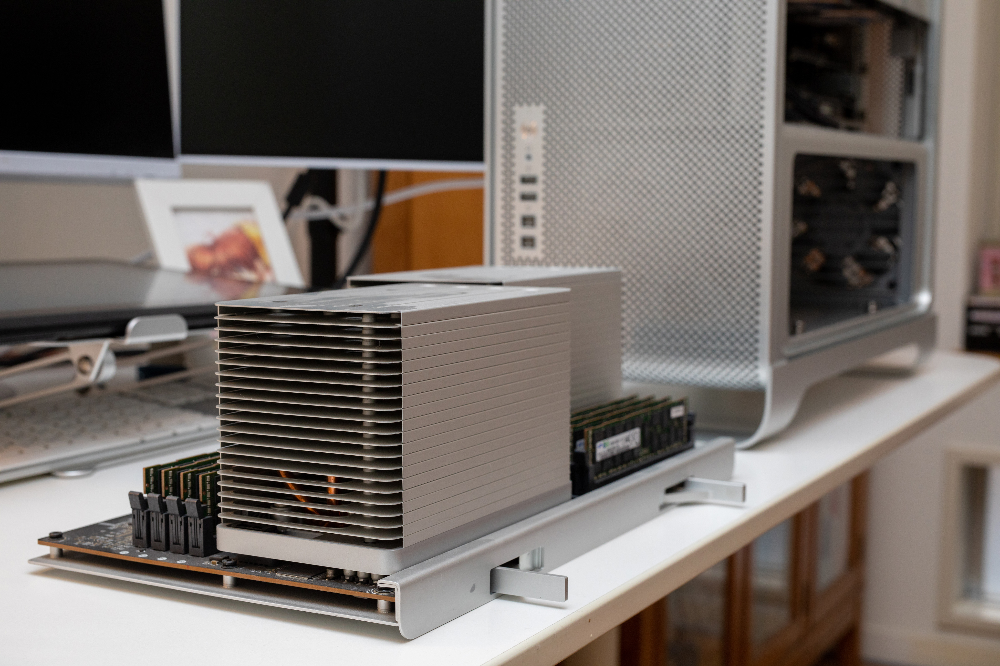
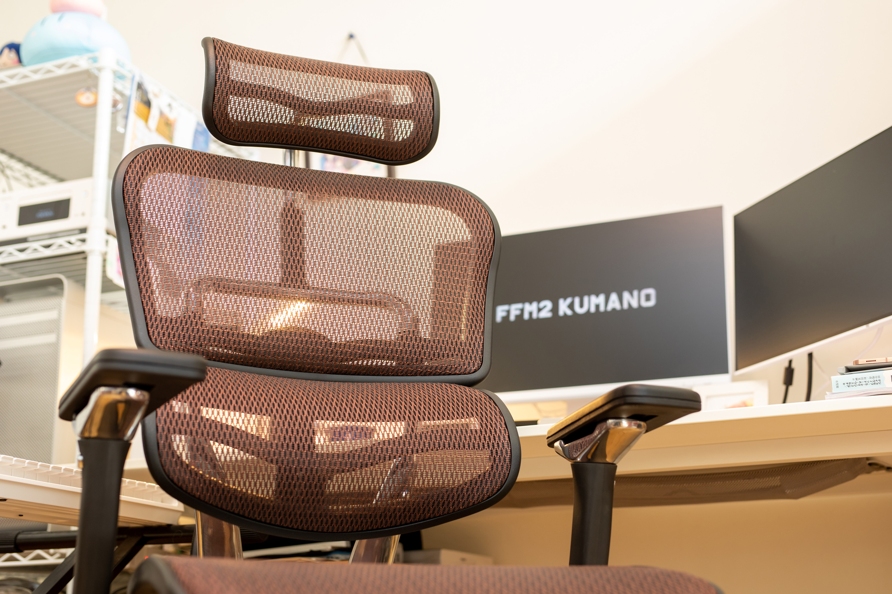
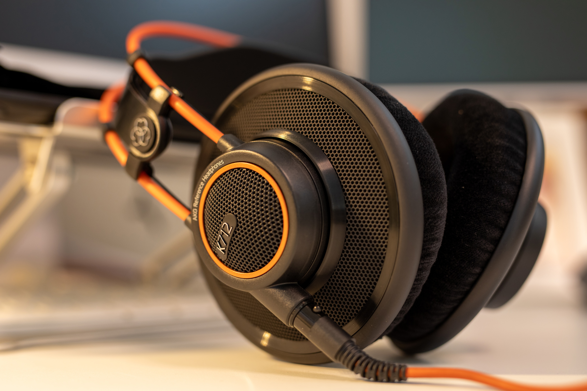
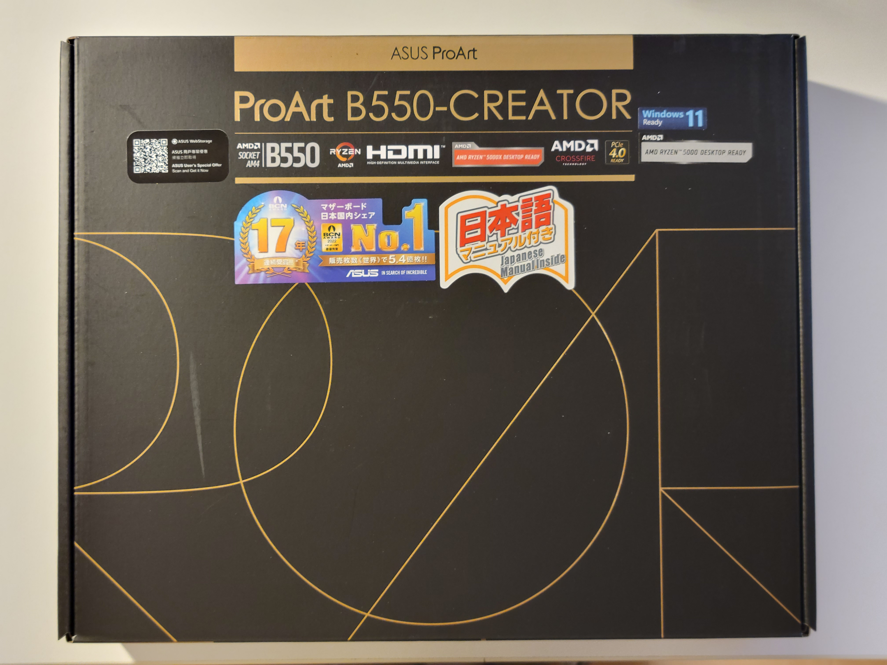

[Yづドン・Rintarnet合同 Advent Calendar 2022](https://adventar.org/calendars/7442) 16日目の記事です。

枠を取ったはいいが、濃い記事を書くネタも時間的余裕もないので、雑に今年買ったものの紹介でもしてお茶を濁そうかと思います。

つっても他のYづ・りんたーねっと諸氏のような派手な買い物は全くしていないので、張り合いのない記事になりそうですね。

PCパーツのアップグレードなどの設備更新がほとんどです。

## 今年買ったもの

### Intel Xeon X5675 × 2

[去年のアドカレ](/yt-advent2021-macpro/)で紹介したMac ProのCPUを換装しました。「今後の展望」の内容を有言実行した形です。

ベースクロックが3GHzほどで、合計24スレッドあります。遂に最強になった。パワフル。最強のパワースポット。

### いいいす（良い椅子）

10年ぐらい使ってきたイケアの椅子を遂に置き換えました。今年で一番アドバンテージの大きい買い物だったかもしれない。

ずっと座っていても永遠に疲れないし、QoL爆上がりです。

### へっどほん（AKG K712 PRO）

左側だけ音が小さいからメーカー修理出さないといけないんだけど面倒くさくて…

たまに接触が良くなってちゃんと鳴りますが、大変良いです。正しい。カラーリングはオオスズメバチみたいだけど。

### 新生舞風サーバ

X58チップセットとかいう化石を遂に卒業し、Intel 第11世代で新しいサーバ機を組みました。

これは[関連記事](/yt-advent2022-maikaze-reborn/)を用意しますので、そっちで詳しくやろうか。

### マザーボード（メイン機）

あと5年ぐらいシバくつもりだったマザーボードが死にやがったので、高騰しまくった販売価格の中で号泣しながら購入しました。

そもそもマザボの問題であると断定するのが難しい感じだったので、とても勇気がいる決断でした。

以上……あれ、マジでこんだけ？

## ほしいもの

何かずっと忙しかったし予期しない出費が痛すぎたしで全然お買い物できませんでしたので、今欲しいものを挙げようかな……って思ったけど、特に欲しい物もないかも……。

強いて言うならラップトップが欲しいかもしれないが、2024年まで買い替える予定はないし、携帯とかも当分変える必要はないし、そもそも要求水準を満たす製品が市場に転がっていないので検討のしようもないね。

あー、音源とか欲しいかもしれないです。

でも何より時間が欲しいかな。

> お伽噺の様な日々は

> 人事（ひとごと）の様に今では半分死んでいる

> 誰も知らないやり方で

> 残り半分が生きてる
　